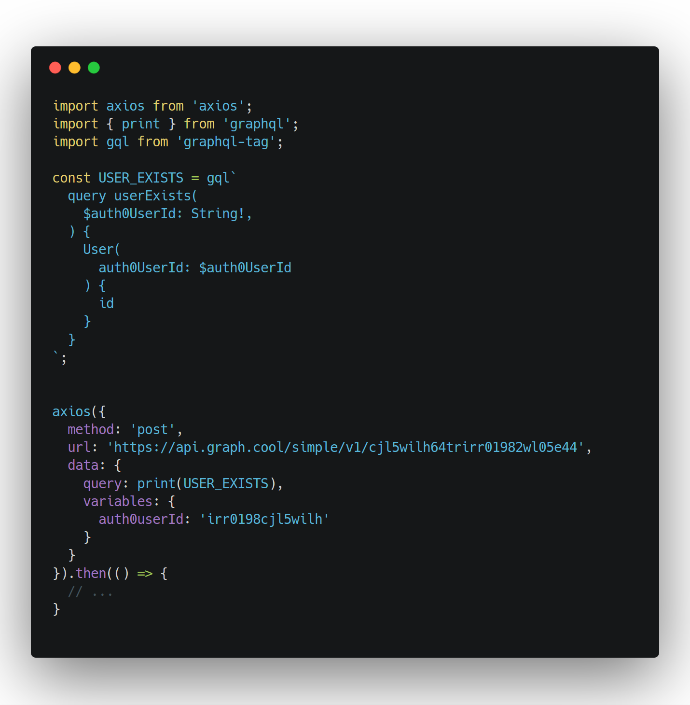
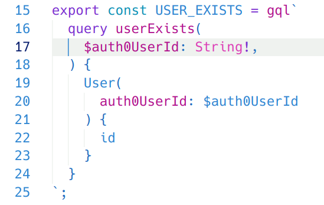

<small>image created with https://carbon.now.sh/</small>

GraphQL APIs are awesome and you should feel lucky if your current project has the data available through a GraphQL endpoint.

You’ve probably heard about GraphQL clients and how they make our lives much better. If you are dealing with a GraphQL API, you really should be using something like [Apollo](https://www.apollographql.com/docs/react/api/apollo-client.html) or [Relay](https://facebook.github.io/relay/) to take full advantage of it.

### Life is not always beautiful

Sometimes though, we could be in a situation in which using a GraphQL client is not an option. Maybe the application is not ready yet to fully incorporate it, or maybe the server is not compatible with it yet (yes, I’ve seen this happening, I don’t know why, though).

Well, GraphQL feels like a fancy new thing but at the end you are still doing the same XHR requests, as you would with REST endpoints, so you can just use a simple HTTP client like [axios](https://github.com/axios/axios):

<iframe src="https://gist.github.com/dlbnco/6b283355c2357946e5da635a42c9e4b6.pibb"></iframe>

**That works!** But sometimes you will need to compose your query or mutation with params, and maybe you will feel tempted to do something like this:

<iframe src="https://gist.github.com/dlbnco/29b72c35f44838869a56210fbbe56fb2.pibb"></iframe>

Template literals, right?! I can bring any variable into my string.

Yes, you can, but that would resolve to something like this:

```
name: Lollipop
```

When the endpoint actually would probably expect:

```
name: "Lollipop"
```

Well, then you could just put quotes around it:

    candy (
      name: "${candyNameFilter}"
    )

And that fortunately will work! But doesn’t feel right. And if your variable is an object or an array, you will have to stringify and sometimes manipulate it so it gets to the desired format.

## The solution

The good thing is we can still directly pass those variables without having to format them, with the help of two libraries:

- [graphql](https://github.com/graphql/graphql-js)

- [graphql-tag](https://github.com/apollographql/graphql-tag)

**First, declare your query and its variables — and their types (if in doubt, refer to the API documentation on GraphiQL):**

<iframe src="https://gist.github.com/dlbnco/e7ad55e8b86874a7d95b177fdb790651.pibb"></iframe>

When calling it, use graphql to print it. And the variables goes in a separate variables property:

<iframe src="https://gist.github.com/dlbnco/5949ebc6b9c68d7f90bdc8bbd700c222.pibb"></iframe>

That’s it! The query will be composed in the right, expected format by the server.

Also, by using graphql-tag you get syntax highlighting and linting capabilities depending on the editor and extensions that will are using. This is a screenshot of my environment with VSCode and some extensions:



👋
