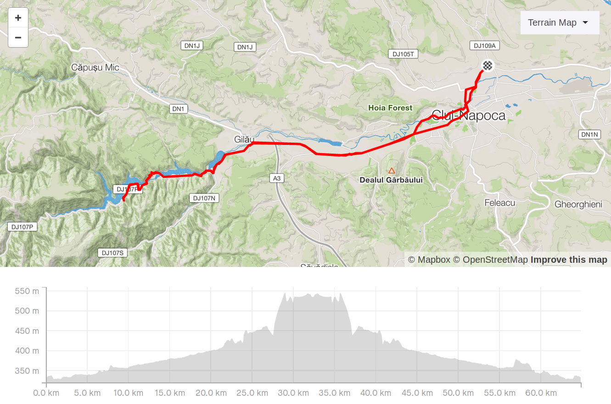
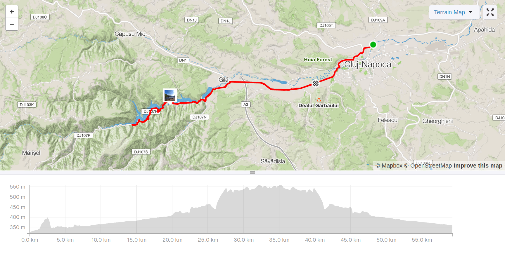

Since I arrived in Romania, I've met at least 3 people that recommended visiting this place once I got to Cluj-Napoca. After moving there and establishing myself, not too long after I found myself checking the route between my house and the lake and looking up street view shots along the way to get a grasp of what the route looks like. It was the perfect candidate for that longer Sunday ride: ~65km.

_Planned route on Strava_

More than half of it is inside the city and its surroundings. Busy streets, lots of cars, few and narrow bike lanes and a brief stretch of a highway-ish road, which at some point merges with a cute village with over-the-street triangle-shaped flags with the Romanian flag colors.

After a left turn, the lake starts to manifest itself. Narrow, pleasant roads, not so many cars and small streams showing the first hints of water. As I keep going, I get more and more surrounded by nature. Lots of trees, fresh air and unobtrusive housing into the landscape. At some point, a bridge comes by and I'm presented to the lake itself.

Amazed by the beauty and with the endorphine rush for riding ~25km at this point, I feel the urge to yell **YES!** and take a moment to enjoy the sight and take the picture above. Along most of the way, the lake is not so visible from the road for being surrounded by vegetation. The clearer sights are on the bridges like this one that crosses the rivers 3 or 4 times.

The road keeps going, getting steeper, colder and in worse condition. The asphalt just goes away for a ~3km stretch. The hills pay off when I get to a dam, which breaks the lake into two levels and provides a nice top view of the area.

The asphalt is back again, and I'm even more surrounded by trees. I feel grateful for being able to ride there. The curves/hills ratio starts to get perfect, I'm having fun and want to go further, but I'm already at the planned 1/2 of ~65km mark and it's time to go back home. Gotta save the energy. I stop by for a brief contemplative moment and a snack. The banana tasted wonderfully and the view was also nice despite being blocked by the trees.

The way back got me off the lake area quicker than I expected and wished. The descents were nice though. Soon I'm around cars and following frequent GPS orders again. I feel a sense of accomplishment. It has been a while since I went for a longer ride.

My thighs hurt, this is not normal. I usually get tired after the 50km mark but it's usually on my back and neck. I started questioning myself what was wrong, but kept going. At some point, 5km away from home, I feel my rear tires going flat — it was probably slowing deflating for a while, thus requiring more effort on my legs. I stop by, breath deeply and start replacing the tube.

The spare tube is finally in, time to pump it up. Turns out it was also bad — it was an old one which was also punctured and I thought I had patched correctly.

Sorry, no photos of the disaster.

I call an Uber and a friendly driver saves my morning. We head back home discussing Romanian politics, history and women. Not bad.

[_Actual ride on Strava_](https://www.strava.com/activities/2748460282)
