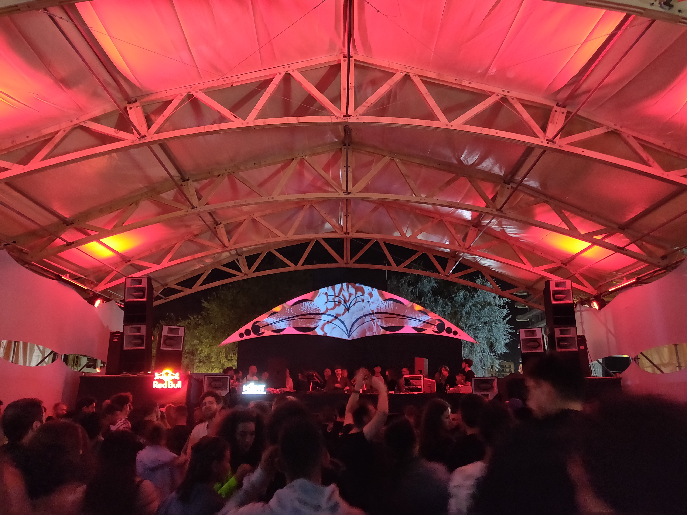
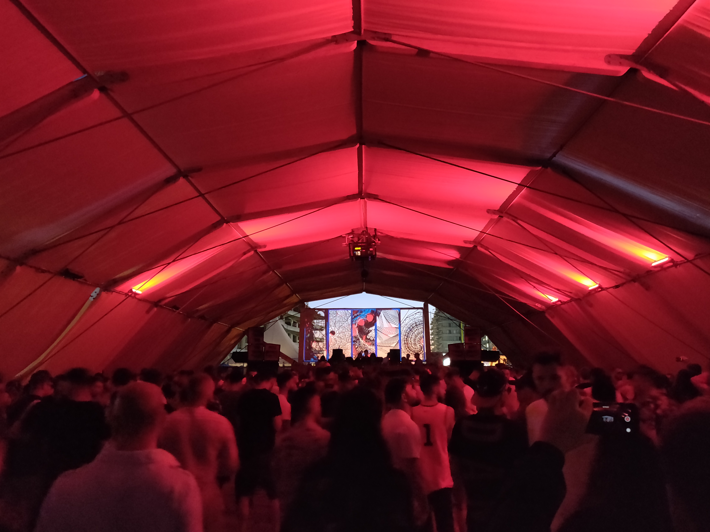
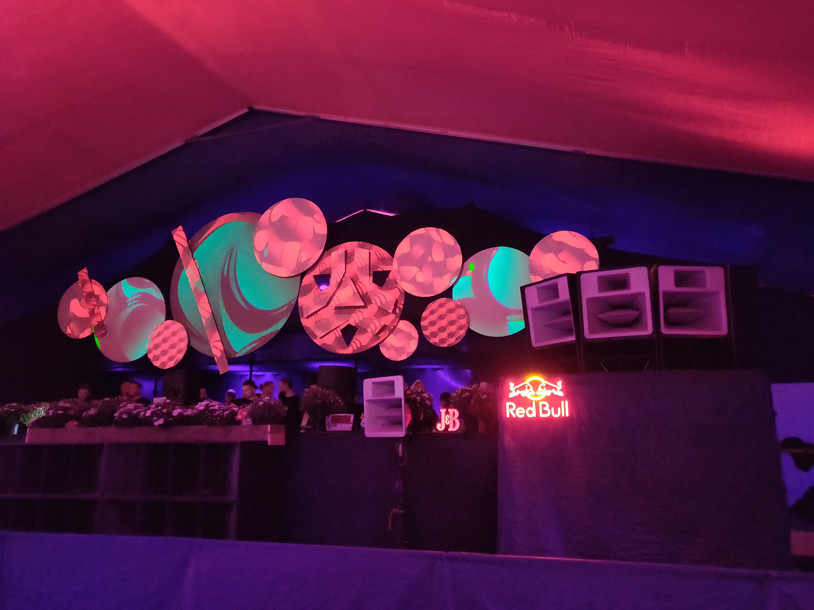

A few years ago, I was discussing electronic music with a close friend after a festival experience we had together in Brazil. At that time, we were starting to dig deeper into it, searching for different and more sensible stuff. He then sent me an article from House Mag—a electronic music publication—entitled [Sunwaves and the Romanian sound](http://www.housemag.com.br/www/noticia/3936-review-sunwaves-e-o-som-da-romenia.html).

The article described something like nothing I've seen or heard before, but it was still house and techno, thus familiar. Most of it is minimalist: Microhouse and Minimal Techno:

> [Minimal Techno] is characterized by a stripped-down aesthetics that exploits the use of repetition and understated development.

[Minimal Techno (Wikipedia)](https://en.wikipedia.org/wiki/Minimal_techno)

> A noticeable difference between microhouse and house is the replacement of typical house kick drums, hi-hats and other drum machine samples with clicks, static, glitches, and small bits of noise [...] One characteristic feature of microhouse is the use of sampling: extremely short ('micro') samples of the human voice, musical instruments, everyday noises and computer created wave patterns are arranged to form complex melodies (such as can be heard in Akufen's "Deck the House"). Vocals in microhouse are often simplistic, nonsensical, and monotone in nature [...]

[Microhouse (Wikipedia)](https://en.wikipedia.org/wiki/Microhouse)

Both genres are not exclusive from Romania, but the country surely has its own flavor: the so-called Rominimal:

> One way to describe it would be minimal techno that has been handled with some very soft, velvety hands. It is simple, yet complicated in its simplicity. This sound opens new channels of consciousness for those who listen. The music is subtle and ethereal, laced with fragile effects over raw sound-drums and minimalist baseline. [...] It’s not about big drops, but it’s more about upholding and continuing the journey.

[The ro-minimal story](https://www.assonantcircles.com/post/the-ro-minimal-story)

I fell in love with the style and started exploring it further through SoundCloud sets and YouTube videos from the festivals happening in Romania. At some point I knew that I should go there and check all of this in person.

In August 2019, after 3 months in western Europe, I went straight to Romania, led by two festivals that felt more iconic: Sunwaves and Mioritmic. I decided not only to attend those events but also spend 3 months in the country—the first month in București and two in Cluj-Napoca. I assumed that if I connect to the music I might just as well enjoy the place and the people.

# Sunwaves Festival

The festival happens in Constanţa, the oldest town in Romania and the go-to beach destination in the country. I arrive there after a 2-hour trip from București. The hostel I booked was very simple and had a funny, yet cute sailor, marine theme. Some young travellers play truth or dare in the yard, probably because the town itself, apart from the beaches, is kinda dull.

In the same night, I head to the northern part of the town—Mamaia, where the most beautiful beaches and high-end hotels are located. And also where the festival happens. Despite being the most valued area, it doesn't feel fancy at all, or maybe it does, but in a silly way.

The festival has 4 stages, which in my interpretation boiled down to each one being focused on: minimal techno; microhouse; tech house and mixed, more mainstream house/techno. They all face the Black Sea and are surrounded by sand, which was inevitably spread through the dancefloors. Slightly different sound setups, but all rocking Funktion One systems. You could see a big building under construction with cranes behind the stages, adding a slight urban feel to the atmosphere.

I love how the festival scenography is just on point and harmonic with the whole concept, including the music. Modest, colorful tents with wood/metal structures. It feels very cozy and welcoming. Most of the decoration is made of wood, plants and cloth. Most stages have a bunch of flower lined in front of it.

The music was just perfect, I can say that it was the best music experience I ever had. I cannot say much about this, as I'm no musician and it's not something you can put into words effectively. But in general, it was the perfect expression of minimal electronic music, powered by good sound engineering, cozy atmosphere, nice people and beautiful scenery.

<iframe width="100%" height="300" scrolling="no" frameborder="no" allow="autoplay" src="https://w.soundcloud.com/player/?url=https%3A//api.soundcloud.com/tracks/687690112&color=%23ff5500&auto_play=false&hide_related=false&show_comments=true&show_user=true&show_reposts=false&show_teaser=true&visual=true"></iframe>

At some point I realized that once my feet got sore from dancing and walking around, I could just get my shoes off and get some cold sea water treatment, which got them ready to several more hours of fun. I could also enjoy the music and dance with my feets in the sea, which felt amazing. The first time I did it I felt liberated for some reason. But eventually you have to go out and get some rest, so I never got to spend more than 12 hours at each day. I spent the first 2 days during the night until early morning, but then I realized that the magic really happens during daytime. You can see the sea and feel the warmth of the sun, and it has just the right amount of people, so you can walk and dance freely without bumping people around, but there is still enough people to maintain the energy.

In the last night, I had to really force myself out of the festival because after 5 days it was still not enough, and the music was still banging. I had a train back to real life the next morning. I started walking in circles.

—Ok, time to go. _(walks toward exit)_

—Wait, just more 15 minutes." _(goes back to the stage)_

# Mioritmic Festival

After 1 month in București, I head to Cluj-Napoca, a lovely university city in Transylvania. It was a great move from the grey and brutalist București. Less cars and noise and more trees and parks. The festival happens near the Hoia forest, which is said to be the most haunted forest in the world. Vampires and a haunted forest. Cool, right?

Mioritmic is organized by the same people as Sunwaves, so most of the concept is similar: tents, decoration and sound. But it felt more intimate. Even though it lasts several days, unfortunately it has some daybreaks in the first days, which was a total bummer. I got a day off work on Friday just to realize it would open just at 10PM. Same on Saturday. That meant getting ready, catch an Uber or tram just to get to the entrance and realize it was closed. There were not many people attending it during those days anyway, so I get why they did breaks, but this was not specified at all in the timetables, which felt kinda disrespectful. In the first days I was also kinda down. Being alone for a month in the city was not being easy.

My experience was that the festival was slowly unfolding itself as the days passed. The peak was obviously between Saturday and Sunday, and most of the action happened during the nighttime.

There were just 3 stages, and not many mainstream-ish acts. The tents are interconnected, with narrow smoking areas in between. There is a larger open air space with food and some chillout areas with heaters. While simple, all of this gives some unique vibe to it.

The music was great through the whole thing, but in the last day, nearing the end, I was feeling like it was just more of the typical Rominimal that I had listened in the last 2 months in other events, I was almost calling it a day and going home. Then, at some point, the music evolved to something really special, with a slightly faster tempo and a deep, dark, and acid substance that is not usually present in the style. It was like a gift for staying for that long. I was so glad that I was listening to something that I really never heard before. I felt like I was experiencing the very moment where a music style evolves in an experimental way, like the artist was showcasing a really nice concept that he thought of, which was slightly challenging to the style itself, but at the same time maintained its essence.

# Untold & Electric Castle

Untold and Electric Castle are the most popular festivals from what I heard. Everytime I mentioned I was in Romania to attend festivals, people thought I was going to Untold. In București and Cluj-Napoca there are huge outdoors for it in the streets.

In fact, in Cluj-Napoca, the place where Untold happens, you can see city infrastructure branded by the festival. I'm not sure whether it's just branding or if the festival actually provided the infrastructure. Either way, it was nice to see that, it gives the impression that the festival is well received by the people and local authorities, and that it may also give back support to the city.

They are more mundane festivals, with huge, outstanding stages, featuring more global artist and diverse kinds of music. Untold has a pretty unique concept though that I never seen before: each stage is located in separate venues. So while being a big festival, I suppose each stage can feel intimate, and being able to explore different areas on each day must be fun.

# Romania, post-communism, Rominimal & underrepresentation

After spending this time living in Romania, I started to correlate the country's unique way of expressing itself through music with its historic, politic context and everyday life.

> Sometimes referred to as 'Europe's great survivor', this melting pot of Romanians, Hungarians, Germans and Roma has been constantly invaded and occupied throughout its existence.

[Romania history (Lonely Planet)](https://www.lonelyplanet.com/romania/background/history/a/nar/2684279e-b5ef-4af2-8c5c-a60ac92c9d6c/360382)

Romania, as we know, is just 100 years old. It is a country that struggled to conquer sovereignity and respect. It just joined the European Union in 2007, and it is still facing barriers to get into the Schengen free travel zone.

> Romania and Bulgaria were judged by the European Commission to have met all necessary technical conditions for full Schengen membership as far back as 2011. No other countries considered to have met the criteria have been kept out.
>
> “We see it as discrimination,” George Ciamba, the Romanian minister for European affairs, said in an interview.

[_Romania Pushes to Be Treated as a Fully Fledged E.U. Member_](https://www.nytimes.com/2019/09/21/world/europe/romania-eu-schengen-zone.html)

It is also important to consider that the country went through around 40 years of communism, an era that certainly suppressed people's expression and identity. After the end of communism in the 90s, I feel that the country is still finding the way of recovering and rebuilding its identity. I believe Rominimal is part of that.

It's interesting how the mainstream culture there is kinda exaggerated and over the top, or kitsch, if you wish—flowers everywhere, colorful bathrooms and overly-ornamented items. Maybe this is a reaction to the country's underrepresentation, or a way to compensate the decades of grayness from the communist era. In the other hand, the underground—Rominimal—can be quite the opposite, while still sometimes maintaining some of the colorfulness—in a minimalist way, of course. It could be a reaction to the mainstream; or a way of embracing and expressing the country's fate. I believe it is some of those, combined.

For me, it became natural to associate minimal music with a modest, humble, rising and sometimes suppressed country. Some people criticize the style though. I met a Romanian girl who said that she can't stand the style anymore and prefers to go to Berlin or Ibiza to party instead.

> That’s been big in Romania for ten years or so, and it never dies. It doesn’t evolve, either; it’s somehow stuck in its own bubble. [...] I can’t explain how, in the city with the fastest internet in Europe, 18- to 20-year-old kids are stuck in only one genre and listening to the same loop for 12 hours. For me, it’s not a very interesting scene

[After The Fire: How The Colectiv Tragedy Changed Bucharest](https://www.electronicbeats.net/after-the-fire-how-the-colectiv-tragedy-changed-bucharest/)

What if it is "stuck in its own bubble" because that's just enough for them? I think that's the whole point of minimalism. I also believe that the style got enough attention to get consolidated and associated with the country, which must feel positive to people that are establishing themselves as a nation.

Judgments aside, people enjoy it, and it's certainly alive.
