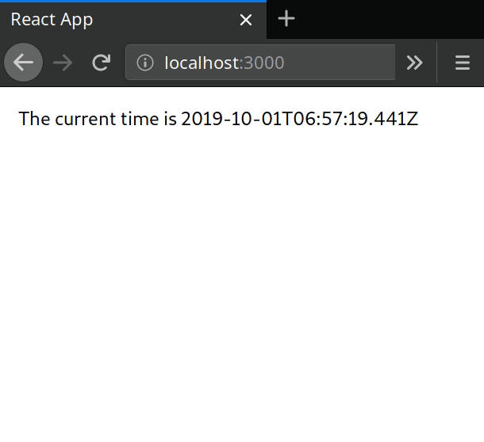

[**TL;DR show me the code**](#the-hook)

In the last few months, I found myself building a few applications and features inside existing projects which relied on real-time. That means having stuff being updated in real-time on the screen as time passes. After iterating the code, I came up with a handy React hook that can be used like this:

```javascript
import React from 'react';
import useRealTime from './hooks/useRealTime';

const RealTimeComponent = () => {
  const now = useRealTime();
  return <div>The current time is {now.toISOString()}</div>;
};

export default RealTimeComponent;
```



# How it works

Our function uses two existing hooks:

## 1. `useState`

This will store the current value and provide an updater function for it. Every time there is an update it will trigger a re-render.

## 2. `useEffect`

This will create an [interval](https://developer.mozilla.org/en-US/docs/Web/API/WindowOrWorkerGlobalScope/setInterval), which will repeatedly call our time updater function with an up to date value with a fixed time delay between each call.

The interval is created just once when the component mounts — notice the empty array `[]` of dependencies at the end (you can also omit the `[]` if you want). The interval is also cleared when the component unmounts.

Also notice that the main `useRealTime` function accepts an `interval` parameter, which is the amount of time in milliseconds between each update and is set to `100` as default.

---

At the end, we just return the current `now` value.

# The hook

```js
import { useState, useEffect } from 'react';

const useRealTime = (interval = 100) => {
  // 💾
  const [now, setNow] = useState(new Date());
  // ⏱️
  useEffect(() => {
    const realtimer = setInterval(() => {
      setNow(new Date());
    }, interval);
    return () => {
      clearInterval(realtimer);
    };
  }, []);
  // 📨
  return now;
};

export default useRealTime;
```
