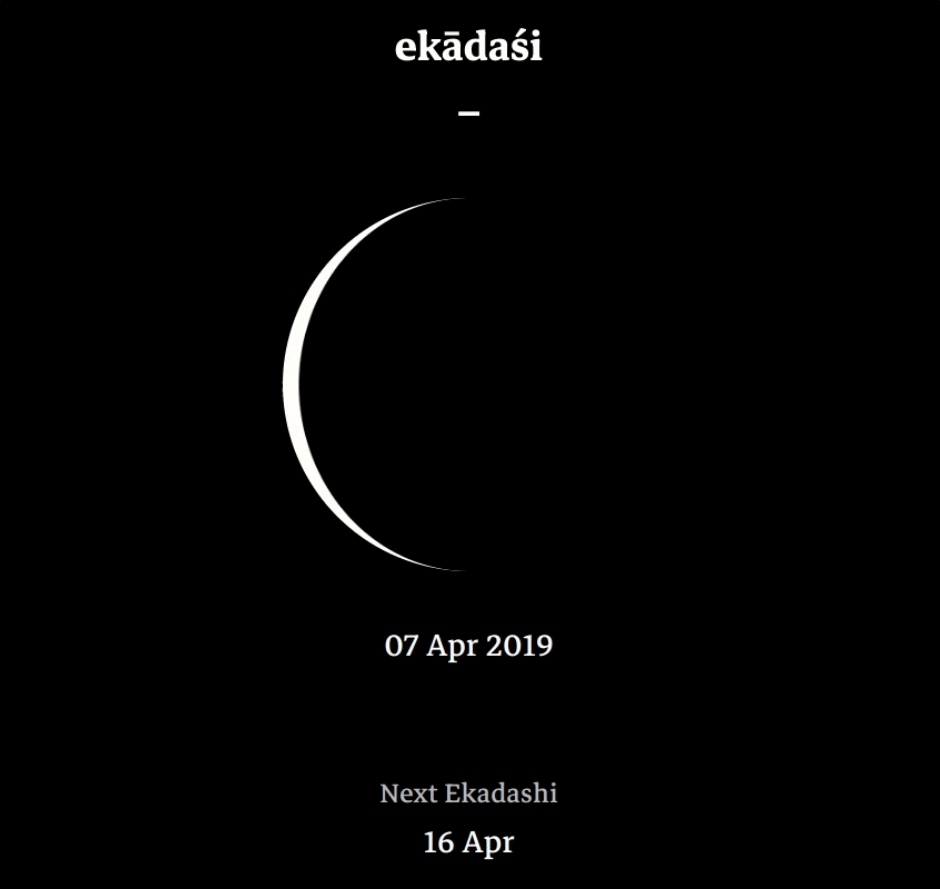

- how it became

A few months ago I built [ekadasi](https://ekadasi.dlbn.co), an Ekadashi calendar. Having up to date time + date was fundamental, since the information needed to be always up to date since it relies on the current date + time. Here is a time-lapse of how it looks like:

- converting to hooks

- how to use

- downsides (multiple intervals) and how to circunvent
